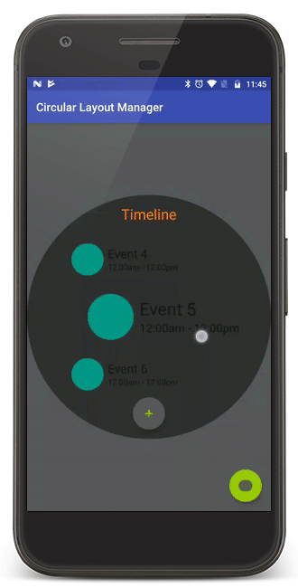

# Circular Layout Manager

### Overview
A library for Android which essentially contains a Custom Layout Manager for Recycler View which lays out its child views in circular or elliptical fashion.

An implementation of a scroll wheel is built which enables the user to scroll the list with a circular motion of the finger.

Circular Constraint Layout is provided to clip the layout containing recycler view into an ellipse or a circle.

<br>



<br>

### Project Details
Circular layout manager extends RecyclerView.LayoutManager directly. Scrolling, laying out child views, incorporating decorations and margins, scaling, centering are some of the things that are handled.

The latest version is written in Kotlin and uses AndroidX components.

<br>

### Additional Features:
* **Circular Layout Manager:**
	* Scaling and centering (Enable or disable)
	* Setting scaling factor
	* Item decorations
	* Scrolling and smooth scrolling to position
	* Saving of state, i.e., scroll position (Useful during configuration changes)
	* Accessibility support
<br><br>
* **Scroll Wheel:**
	* Enabling continued scrolling even when finger goes outside touch area
	* Highlight touch area
	* Touch area's inner radius adjustment
	* Touch area color selection
<br><br>
* **Circular Constraint Layout:**
	* Setting primary dimension which enables auto adjustment of one of the dimensions (width or height) of the layout depending on the length of the other

<br>

## Integeration

Use the following dependency snippet in your app level build.gradle file to include this library in your project:

```groovy
dependencies {
    ...
    ...
    compile 'com.github.kapil93:circular-layout-manager:2.0.0'
}
```

<br>

## Versions

* 2.0.0 (Kotlin & AndroidX)
* 1.0.0